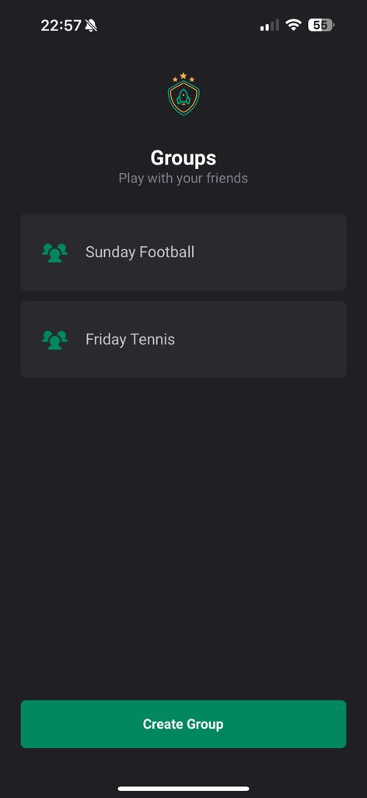
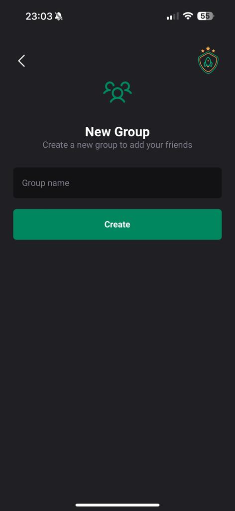
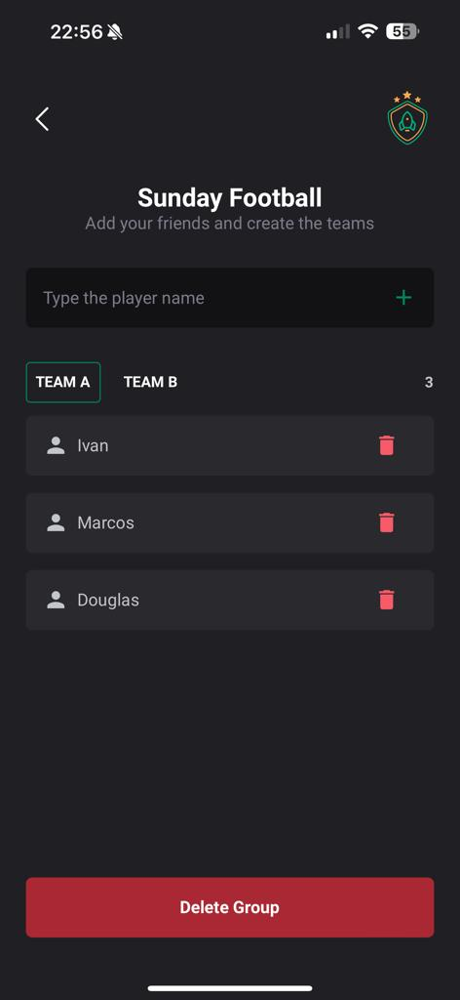

# TeamUp Playmaker

## Overview

TeamUp Playmaker is a mobile application built with React Native and TypeScript, designed to streamline the organization of group gaming groups. Whether you're planning a casual game night or a competitive team face-off, TeamUp Playmaker makes it easy to create, manage, and join gaming groups.

## Features

- **Groups List**: View a list of all created groups. Users can tap on an group to view more details or create a new group.

- **Create New Group**: Users can create a new group, giving it a unique name and setting up the details.

- **Group Details**: In this screen, users can add members to two different teams: Team A and Team B. There's also an option to delete the group.

## Installation

To get started with TeamUp Playmaker:

1. Clone the repository:

```bash
git clone git@github.com:ivanseibel/teamup-react-native-experiments.git
```

2. Install dependencies:

```bash
npm install
```

3. Run the app:

```bash
npm start
```

## Screenshots

<p float="left">
  
   
   
</p>

## Contributing

Contributions to TeamUp Playmaker are always welcome, whether it's improving documentation, fixing bugs, or implementing new features. Please read our contribution guidelines before submitting a pull request.


## License

TeamUp Playmaker is released under the [MIT License](LICENSE).
